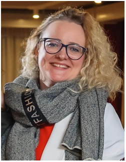

# Наталья Меньшикова

Прохожу обучение на образовательной онлайн-платформе Нетология (2024г.).

**Хочу связать свою жизнь с IT и выбрала для себя направление Тестировщик ПО.**

Ответственна в любой работе и легко обучаюсь.

Могу преподавать. Закончила магистратуру АлтГУ по специальности Преподавание по отраслям (2023г.). 

Имею высшее экономическое образование ВЗФЭИ по специальности Бухучет, анализ и аудит (2011г.). 
Долгое время работала главным бухгалтером в нескольких организациях.

Имею разностороннее развитие на базе своего первого гуманитарного образования АлтГУ по специальности Специалист по международным отношениям (2003г.).

Творческая личнось во всех направлениях. Имею дополнительное профессиональное образование АлтГУ по специальности Живопись (2022г.).

_**Мой девиз:**_ **если хочешь чем-то заниматься, то обучись и делай это хорошо!**
